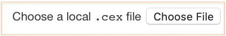

 
# Discoverable Data Models and Extended Text Properties in the CITE Architecture

A presentation at DH 2019, Utrecht, by Christopher W. Blackwell (Furman University) & Neel Smith (College of the Holy Cross). 

<http://cite-architecture.org>

Questions or comments to:

Christopher Blackwell (<christopher.blackwell@furman.edu>).

<https://github.com/eumaeus/>

<https://github.com/homermultitext>

<https://github.com/cite-architecture>

## Organization of This Repository

~~~
.
├── CEX_Tutorial
│   ├── 0_Text_and_Translation.cex
│   ├── 1_Citable_Tokens.cex
│   ├── 2_Commentary_Text.cex
│   ├── 3_Collection_TextBearingSurface.cex
│   ├── 4_Image_Collection.cex
│   ├── 5_DataModel_Binary_Image.cex
│   ├── 6_DataModel_DSE.cex
│   ├── 7_DataModel_Commentary.cex
│   ├── 8_DataModel_Commentary2.cex
│   ├── 9_Extended_String_Property_Types1.cex
│   ├── 10_Extended_String_Property_Types2.cex
│   ├── 11_Adding_an_Annotation.cex
│   └── HMT.cex
├── CITE-App
│   ├── LICENSE.md
│   ├── README.md
│   ├── cite-1.14.0.html
│   ├── citeApp-js
│   └── image_archive
├── README.md
├── abstract.md
└── presentation
    ├── dh2019.html
    ├── dh2019.md
    ├── images
    └── reveal.js
~~~

### CEX_Tutorial

A directory of progressively more complex expressions of digital libraries in CEX, with internal comments. There is also a test-build of a complete *Homer Multitext* dataset, as of July 2019.

### CITE-App

A web-app for exploring CITE data. Open it in a browser, and use the control shown below to load one of the `.cex` files. 

Click around and see what you can see.

### Presentation

The source files for the live presentation in Utrecht.

If you have [Pandoc](https://pandoc.org) installed, you can build the presentation from source with:

~~~ bash
cd /presentation
pandoc -t revealjs dh2019.md -s -o dh2019.html --metadata pagetitle=DH2019 -V theme=solarized
~~~

Open `dh2019.html` to view the presentation in your browser.

## Some Applications Using CEX

Below are some live links to applications and services currently using the CITE Architecture, and more importantly, loading data from CEX files featuring the “discoverable data models” that are the focus of this presentation.

- [*Homer Multitext* Microservice](http://beta.hpcc.uh.edu/hmt/hmt-microservice/). While all of the implementations discussed here are written in [Scala](https://www.scala-lang.org), the [SCS-Akka Microservice](https://github.com/cite-architecture/scs-akka) can deliver CITE data from a CEX file as JSON. This page demonstrates the requests that this microservice supports.
- [This Ancient Greek Lexicon](http://folio2.furman.edu/lsj/). Discussion [here](https://eumaeus.github.io/2018/10/30/lsj.html), [here](https://eumaeus.github.io/2018/11/04/lexService.html), and [here, on versioned collections in CITE](https://eumaeus.github.io/2018/11/05/chicago.html).
- [This Latin Dictionary](http://folio2.furman.edu/lewis-short/index.html)
- [*Homer Multitext* Facsimile View](http://www.homermultitext.org/digital/)
- [Reading Kits](http://folio2.furman.edu/readingKit/iliad_17_1.html)
- Alignment tools: [Haiku example](http://folio2.furman.edu/textCart/alignment/demo4.html?urn=urn:cts:fuMisc:basho.kawazu.fuEd.tok:&urn=urn:cts:fuMisc:basho.kawazu.fuEdKana.tok:&urn=urn:cts:fuMisc:basho.kawazu.fuEdRom.tok:&urn=urn:cts:fuMisc:basho.kawazu.fuTransEng.tok:&urn=urn:cts:fuMisc:basho.kawazu.saijiki:&urn=), [2-way translation alignment example](http://folio2.furman.edu/textCart/alignment/demo3.html?urn=urn:cts:greekLit:tlg0016.tlg001.grc.token:1.8.0-1.8.33&urn=urn:cts:greekLit:tlg0016.tlg001.eng.token:1.8.0-1.8.33&urn=), [4-way translation alignment example](http://folio2.furman.edu/textCart/alignment/demo2.html?urn=urn:cts:greekLit:tlg0031.tlg003.kjv.token:2.1&urn=urn:cts:greekLit:tlg0031.tlg003.reina.token:2.1&urn=urn:cts:greekLit:tlg0031.tlg003.vulgate.token:2.1&urn=urn:cts:greekLit:tlg0031.tlg003.wh.token:2.1&urn=)
- [Some CEX libraries online](https://github.com/cite-architecture/citedx)

